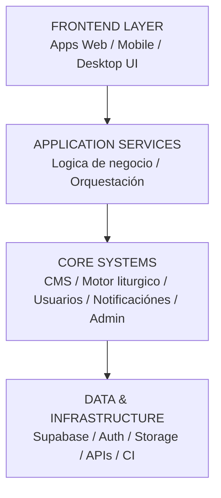
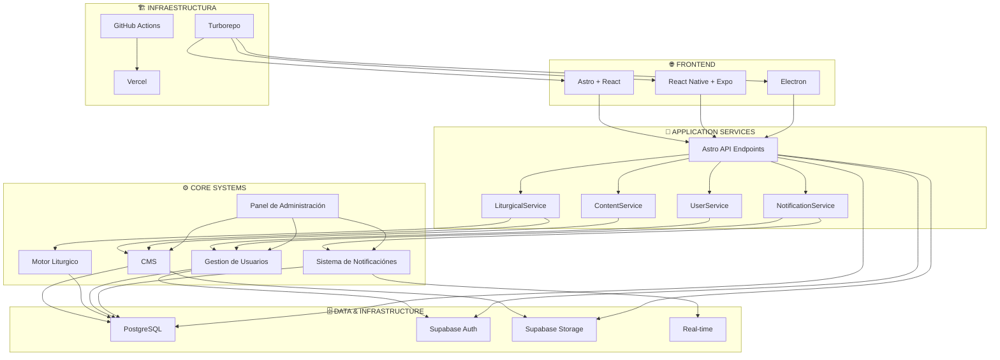

---
tags:
  - proyecto/fosforo
  - arquitectura
  - tecnologia
  - stack
type: documentación-tecnica
area: arquitectura
status: vigente
created: 2026-03-07
updated: 2026-05-06
related:
  - "[[README|Arquitectura]]"
  - "[[Estructura Monorepo|Monorepo]]"
---

# Stack Tecnologico

> [!info] Tecnologías del Ecosistema Fósforo
> Stack moderno para web, móvil y escritorio

---

## 🌐 Frontend

### Web

#### Astro

**Framework principal** para aplicaciónes web estáticas y dinámicas

- ⚡ Rendimiento excepcional
- 🎯 Islands Architecture
- 📦 Build optimizado

#### React

**Librería UI** para componentes interactivos

- 🔄 Componentes reutilizables
- 🎨 Ecosistema maduro
- ⚛️ Virtual DOM

#### TailwindCSS

**Framework CSS** utility-first

- 🎨 Diseño consistente
- 📱 Responsive por defecto
- ⚙️ Altamente configurable

#### TypeScript

**Tipado estático** para JavaScript

- ✅ Type safety
- 🔍 Mejor autocompletado
- 🐛 Menos bugs en runtime

---

## 📱 Mobile (iOS & Android)

### React Native

**Framework móvil** multiplataforma

- 📱 iOS y Android con una base de código
- ⚛️ Componentes nativos
- 🔥 Hot reload

### Expo

**Tooling y SDK** para React Native

- 🛠️ Desarrollo simplificado
- 📦 Bibliotecas pre-configuradas
- 🚀 Updates OTA (Over The Air)

### Expo Router

**Navegación** basada en archivos

- 📂 File-based routing
- 🔄 Stack, tabs, modals
- 🌐 Deep linking

### AsyncStorage

**Almacenamiento local** persistente

- 💾 Key-value storage
- 🔒 Datos offline
- ⚡ Rápido acceso

---

## 💻 Desktop (Windows, macOS, Linux)

### Electron

**Framework** para apps nativas de escritorio

- 🖥️ Multi-plataforma
- 🌐 Chromium + Node.js
- 🎨 UI moderna

### Electron Builder

**Packaging y distribución**

- 📦 Instaladores nativos
- ✍️ Code signing
- 🔄 Auto-updates

### Electron Vite

**Build tool** optimizado

- ⚡ Desarrollo rápido
- 🔥 Hot reload
- 📦 Build eficiente

### electron-updater

**Auto-actualizaciónes**

- 🔄 Updates automáticos
- 📥 Descarga en background
- ✅ Verificación de firmas

---

## 🔧 Backend & Database

### Astro API Endpoints

**Backend ligero** integrado

- 🎯 Server-side rendering
- 🔌 API routes
- 🚀 Edge-ready

### Supabase

**Backend-as-a-Service** completo

#### PostgreSQL

- 🗄️ Base de datos relaciónal
- 🔍 Queries SQL potentes
- 📊 Relaciónes complejas

#### Auth

- 🔐 Autenticación
- 🎫 JWT tokens
- 👥 Multiple providers

#### Storage

- 📁 Almacenamiento de archivos
- 🖼️ Imágenes, audios, PDFs
- 🔒 Políticas de acceso

#### Real-time

- ⚡ Suscripciones en tiempo real
- 🔔 Notificaciónes
- 📡 WebSockets

---

## 🏗️ Infraestructura

### Turborepo

**Monorepo** de alto rendimiento

- 📦 Multi-package workspace
- ⚡ Build cache inteligente
- 🔄 Parallel execution

### pnpm

**Gestor de paquetes** eficiente

- 💾 Ahorro de disco
- ⚡ Instalaciónes rápidas
- 🔗 Linking eficiente

### GitHub Actions

**CI/CD** automatizado

- 🤖 Pipelines automáticos
- ✅ Testing continuo
- 🚀 Deploy automatizado

---

## 📊 Diagrama de Arquitectura

### Vision por capas

### Vista tecnologica

---

## 🔄 Flujo de Datos

### Ejemplo de flujo transversal

Caso: `Espiritualidad diaria`

1. Frontend llama a `LiturgicalService`.
2. `LiturgicalService` consulta el Motor liturgico para resolver el estado liturgico del día.
3. `LiturgicalService` consulta el CMS para obtener contenido asociado.
4. El servicio compone lectura, oración, santo y metadatos liturgicos.
5. El frontend renderiza la experiencia final.

### Flujo base de plataforma

### 1. Usuario → Frontend

Usuario interactúa con la interfaz (Web/Mobile/Desktop)

### 2. Frontend → API

Componente realiza llamada a Astro API endpoint

### 3. API → Supabase

API procesa y se comúnica con Supabase

### 4. Supabase → API

Base de datos ejecuta query y retorna datos

### 5. API → Frontend

Respuesta se devuelve para renderización

---

## 🔐 Seguridad

### Autenticación

- ✅ Supabase Auth con JWT
- ✅ Multiple providers (email, Google, etc.)

### Autorización

- ✅ Row Level Security (RLS) en PostgreSQL
- ✅ Políticas granulares por tabla

### Validación

- ✅ Zod para validación en runtime
- ✅ TypeScript para validación en compile-time

### Protección

- ✅ Rate limiting en endpoints
- ✅ CORS configurado
- ✅ Sanitización contra XSS
- ✅ Protección SQL injection

---

## ⚡ Escalabilidad

### Horizontal

- 🔄 Múltiples instancias con load balancer
- 📦 Deployments independientes

### Caching

- 💾 Redis para queries frecuentes
- 🌍 CDN para assets estáticos

### Database

- 📊 Supabase maneja escalabilidad
- 🔍 Índices optimizados

### Edge Functions

- 🌐 Lógica con baja latencia
- 📍 Cerca del usuario

---

## 🚀 Deployment

### Web Apps

- **Vercel** (usando `@astrojs/vercel`)
- ✅ Deploy automático desde GitHub Actions
- ✅ Preview environments
- ✅ Edge Functions y Serverless Functions

### Mobile Apps

- **App Store** (iOS)
- **Google Play** (Android)
- **Expo EAS** para builds

### Desktop Apps

- **GitHub Releases**
- **Auto-updates** con electron-updater
- ✅ Instaladores nativos

### Database

- **Supabase Cloud**
- ✅ Backups automáticos
- ✅ Point-in-time recovery

---

## 🔗 Enlaces Relaciónados

- [[Estructura Monorepo]]
- [[README|Arquitectura]]
- [[../README|Indice de documentación]]

---

## Referencias para Desarrollo

### Desarrollo

- [[README|Arquitectura]] - Setup de herramientas
- [[README|Arquitectura]] - Configuración ESLint/Prettier
- [[../00-General/10-Matriz-de-Trazabilidad|Matriz de Trazabilidad]] - Configuración Vitest/Playwright

### Arquitectura

- [[Estructura Monorepo|Estructura Monorepo]] - Organización packages

### Planificación

- [[../00-General/06-PRD-Maestro|PRD Maestro]] - Fases de desarrollo

---

## Tags

#stack #tecnologia #arquitectura #astro #react #supabase #turborepo #frontend #backend #mobile #desktop
