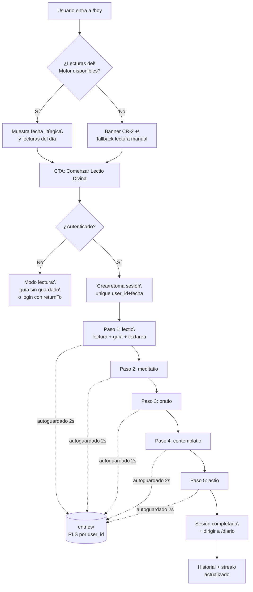
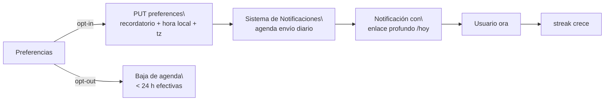
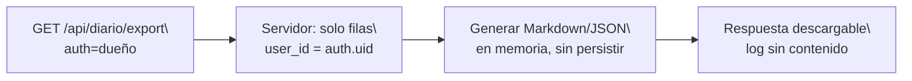
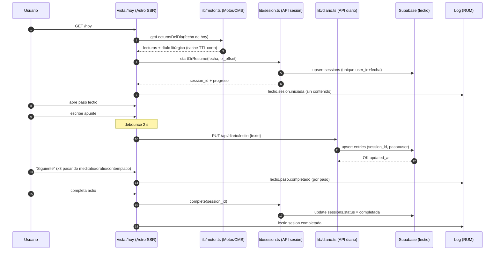
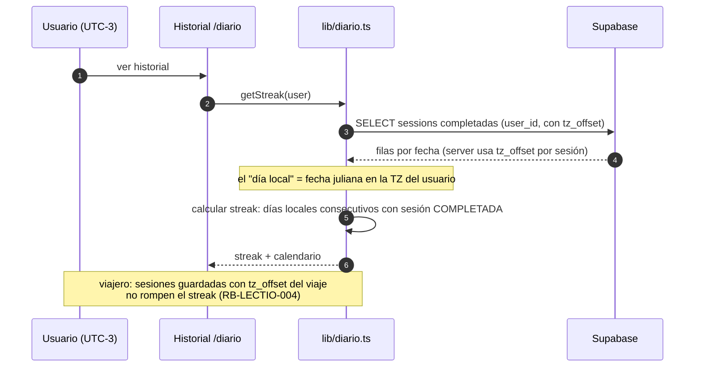
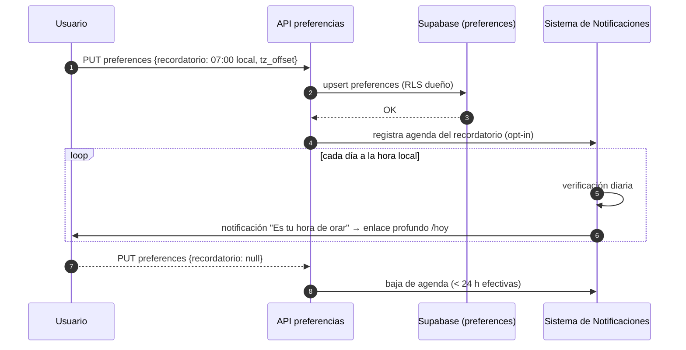

---
tags:
  - proyecto/fosforo
  - app/lectio-divina
  - fase/2
  - plataforma/web
type: app-arquitectura
owner: Iván Ezequiel Iencinella
status: draft
created: 2026-09-05
updated: 2026-09-05
---

# Flujos y Secuencias — Lectio Divina (WEB)

> Generado con Kimi K3 (Moonshot AI). Owner: Iván Ezequiel Iencinella.

## 1. Flujo principal: hoy → sesión → diario



Puntos clave:

- **Idempotencia:** "Comenzar" el mismo día retoma la sesión (`unique(user_id, fecha)`, RB-LECTIO-003).
- **Autoguardado por paso:** debounce 2 s → PUT `/api/diario/{paso}`; nunca se pierde el texto al recargar (ADR-LECTIO-003).
- **Privacidad visible:** indicador "Solo tú puedes leer esto" cerca del campo y del diario.

## 2. Flujos secundarios

### 2.1 Historial de práctica

```mermaid
flowchart LR
    A[/diario] --> B[GET sessions del user\\n Orden por fecha desc]
    B --> C[Calendario/lista + streak\\n con tz_offset del usuario]
    C --> D{¿Sesión de ese día?}
    D -- Sí --> E[Ver entradas en\\nmodo lectura / editar]
    D -- No --> F[CTA: orar ese día\\n→ /hoy]
```

### 2.2 Recordatorio de práctica (opt-in)



### 2.3 Exportación del diario



## 3. Secuencias de sistema

### 3.1 Sesión guiada: Motor lecturas + pasos + autoguardado del diario



Errores de la secuencia: si Motor no responde → CR/LECTIO-E-003 (fallback manual, sesión igualmente creada); si falla el PUT de diario → LECTIO-E-005 (reintentos + cola local en cliente).

### 3.2 Streak con zona horaria del usuario



### 3.3 Recordatorio vía Notificaciones con enlace profundo



## 4. Consideraciones transversales

- **Modo lectura (sin auth):** las mismas secuencias de lectura funcionan sin `user_id`; solo se suprimen escrituras de `entries` (UC-LECTIO-008).
- **RUM:** número 3.1 emite ` sesion.iniciada`, ` paso.completado` y ` sesion.completada` bajo consentimiento (UC-LECTIO-007); nunca con contenido.
- **Cache:** `lib/motor.ts` cachea lecturas de presentación con TTL corto (p. ej. 15 min); ante CMS caído sirve última cache (ERM-LECTIO-004).
