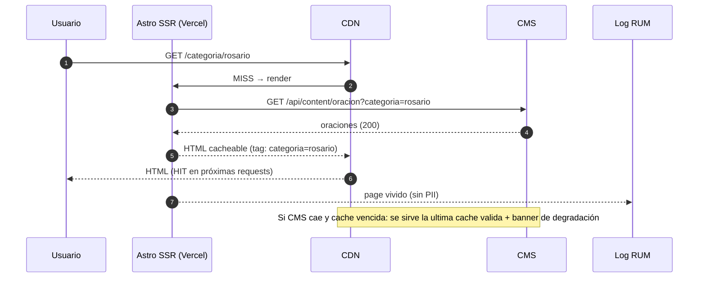
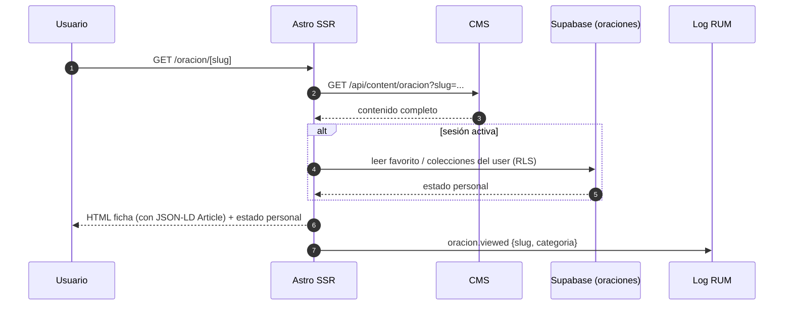
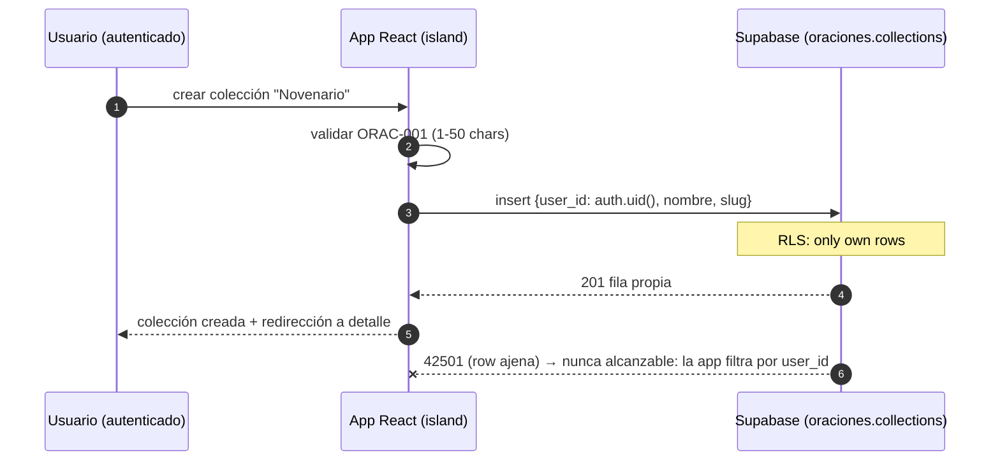
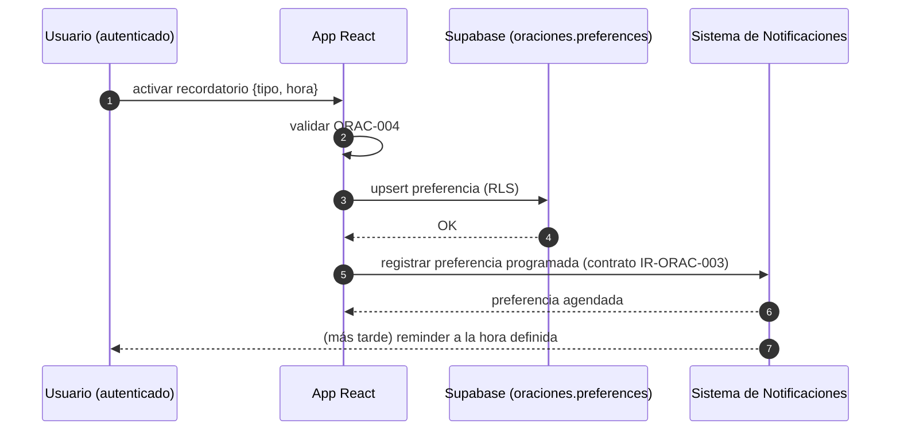

---
tags:
  - proyecto/fosforo
  - aplicacion
  - oraciones
  - web
  - fase-2
  - flujos
  - secuencias
type: app-arquitectura
area: aplicaciones
status: draft
created: 2026-09-05
updated: 2026-09-05
related:
  - "[[03-FRD]]"
  - "[[09-Especificacion Tecnica]]"
---

# Oraciones - Web - Flujos y Secuencias

> Generado con Kimi K3 (Moonshot AI). Owner: Iván Ezequiel Iencinella.

## Flujo principal: categoría → ficha (oración)

1. El usuario llega a `/` (home de Oraciones) o directamente a `/categoria/[slug]` desde buscador externo o menú.
2. La página SSR consulta el catálogo del CMS filtrado por taxonomía de categoría (`comunes`, `por-intencion`, `devociones`, `rosario`).
3. El listado muestra cada oración como tarjeta compartida de `@repo/ui`: título, extracto y categoría.
4. El usuario toca una oración → `/oracion/[slug]`.
5. La ficha renderiza texto completo, intención de uso, fuente, breadcrumbs y acciones (favorito, colección, reporte, modo lectura).
6. Se emite RUM `oracion.viewed` con slug y categoría (sin PII).

## Flujos secundarios

### Flujo de búsqueda

1. El usuario activa el buscador y escribe.
2. Con >= 2 caracteres se ejecuta la búsqueda full-text contra el CMS.
3. Se renderizan resultados paginados con resaltado del match.
4. Se emite RUM `oracion.searched` (longitud de consulta, cantidad de resultados; sin texto de la consulta).
5. Tocar un resultado lleva a la ficha; 0 resultados muestra categorías sugeridas.

### Flujo de favoritos

1. Usuario con sesión toca "favorito" en ficha o listado.
2. UI actualiza optimista; la app escribe en `oraciones.favorites` (`user_id`, `content_ref`) vía Supabase con RLS.
3. Error → rollback del estado optimista + toast de error.
4. Sin sesión → se muestra CTA "Iniciá sesión para guardar favoritos" (no bloquea la lectura).

### Flujo de colecciones personales

1. Usuario con sesión abre `pages/colecciones`.
2. Crea colección (nombre 1-50 caracteres) o abre una existente.
3. Agrega oraciones desde ficha/favoritos; actualizando `orden` en `collection_items` para el orden manual (mover arriba/abajo).
4. Ver, renombrar o eliminar colección; eliminar pide confirmación y hace soft-delete de la cabecera (los items se conservan hasta la eliminación definitiva, ver 06).

### Flujo de reporte de error

1. Desde ficha, el usuario abre "Reportar problema".
2. Elige motivo (texto errado, oración incompleta, duplicada, otro) y comentario opcional.
3. Se inserta en `oraciones.reports` con `session_hash` anónimo (insert-only).
4. Confirmación al usuario; el equipo editorial procesa la corrección en el CMS (< 48 h, ver SLO).

### Flujo de recordatorio de devoción

1. Usuario con sesión activa recordatorio: tipo de devoción + hora.
2. Validación ORAC-004; se guarda en `oraciones.preferences`.
3. La app notifica al Sistema de Notificaciones la preferencia programada (contrato IR-ORAC-003).
4. Notificaciones agenda y emite el reminder; esta app no envía ni gestiona el envío.

## Secuencia 1: carga del listado (SSR + cache CMS)

## Secuencia 2: carga de ficha de oración

## Secuencia 3: crear colección (auth + RLS)

## Secuencia 4: recordatorio de devoción (vía Notificaciones)

## Reglas transversales de los flujos

- Ningún flujo requiere sesión salvo favoritos, colecciones y recordatorios.
- Si el CMS no responde, siempre se sirve última cache válida + banner; jamás se sirve contenido local.
- Todos los eventos RUM respetan el anonimato (sin PII, sin texto completo de búsqueda).
