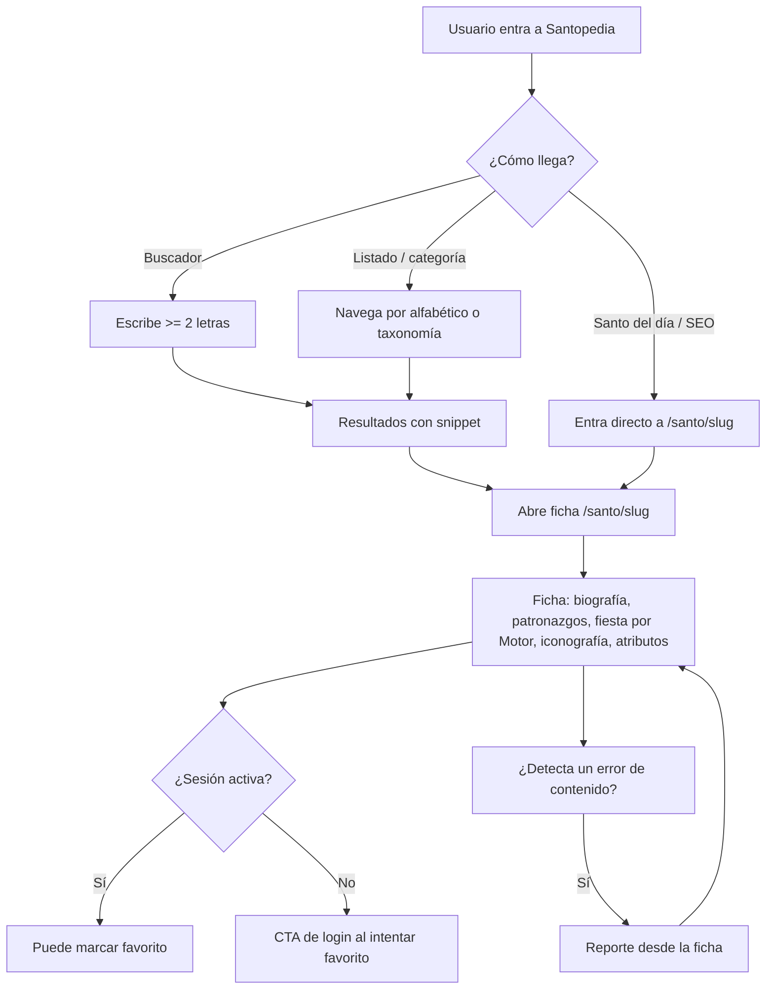
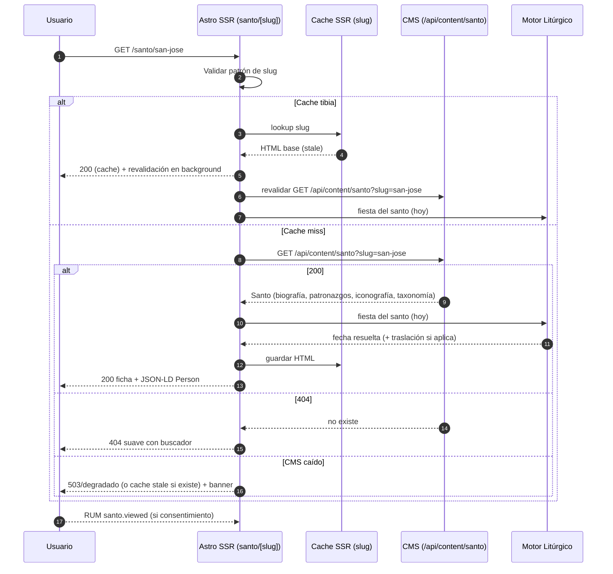
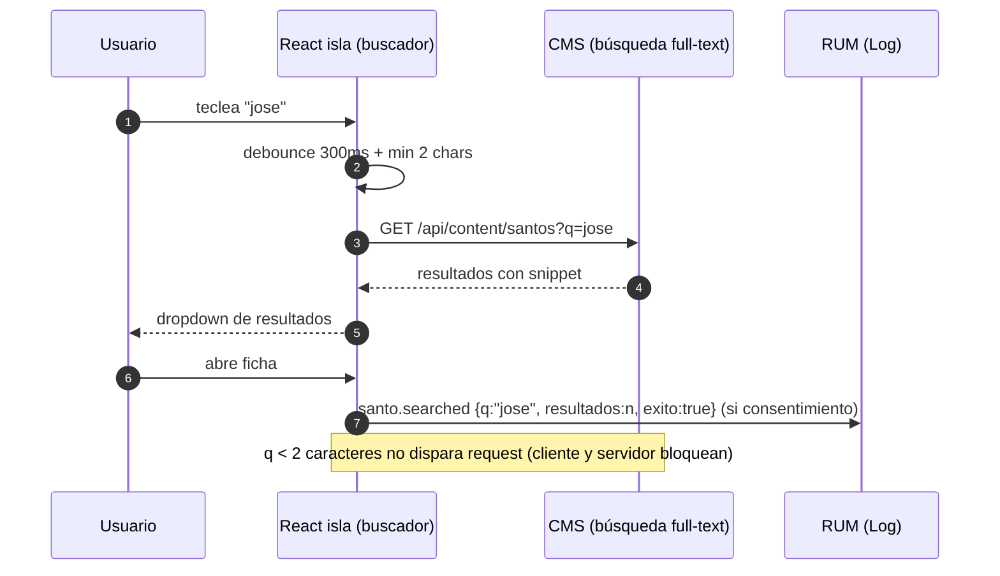
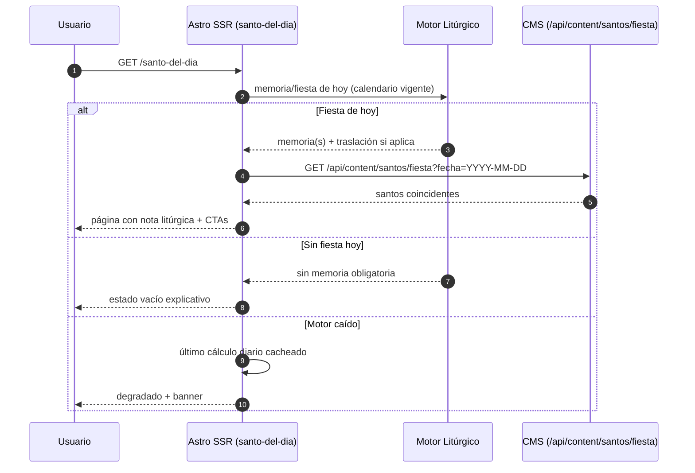
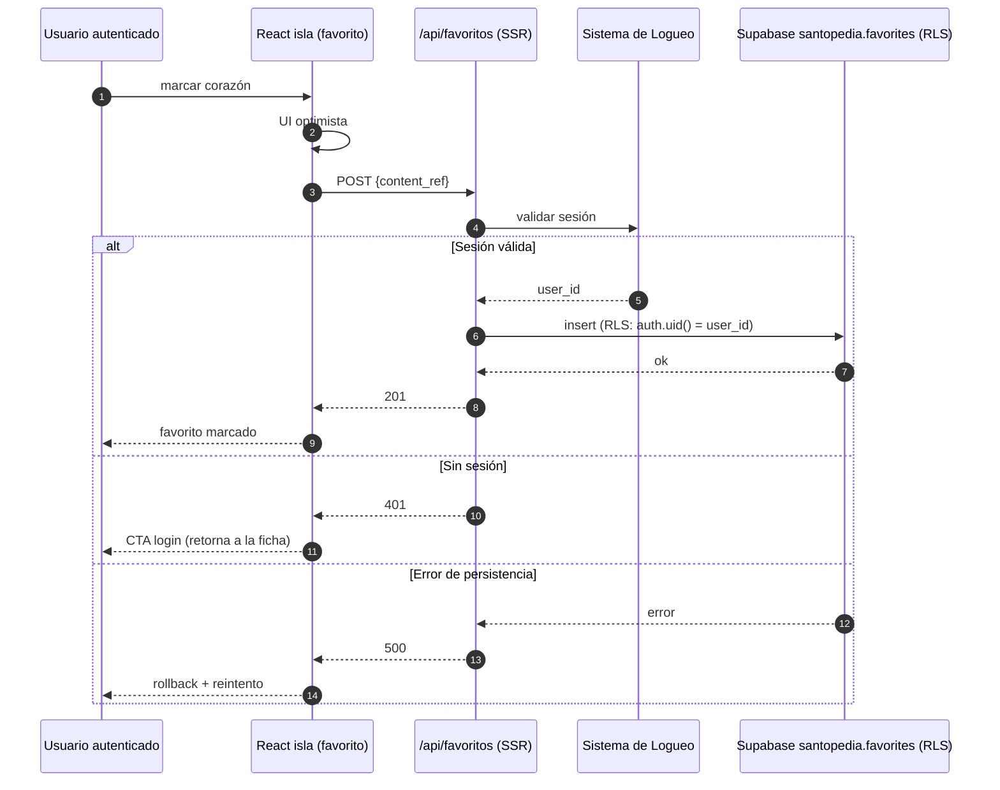

---
tags:
  - proyecto/fosforo
  - santopedia
  - flujos
  - secuencias
  - web
type: app-arquitectura
area: aplicaciónes
status: draft
created: 2026-09-05
updated: 2026-09-05
related:
  - "[[03-FRD|03-FRD]]"
  - "[[05-Tests Unitarios|05-Tests Unitarios]]"
---

# Santopedia — Flujos y Secuencias

> Generado con Kimi K3 (Moonshot AI). Owner: Iván Ezequiel Iencinella.

## 1. Alcance

Este documento modela los flujos de usuario y las secuencias técnicas de Santopedia (fase WEB). Se basa en [03-FRD](03-FRD.md) y alimenta [05-Tests Unitarios](05-Tests%20Unitarios.md).

## 2. Flujo principal — Descubrir y consultar un santo

Puntos de telemetría (solo con consentimiento): `santo.viewed` al render de la ficha (con origen: ficha, busqueda, listado, santo_del_dia) y `santo.searched` al finalizar cada búsqueda (término, cantidad de resultados, éxito).

## 3. Flujos secundarios

### 3.1 Santo del día

1. Entrada desde home/portlet o acceso directo a `/santo-del-dia`.
2. El SSR consulta al Motor la memoria de hoy; con traslación se agrega nota litúrgica.
3. Con la respuesta consulta al CMS las fichas coincidentes y renderiza.
4. Sin fiesta hoy → estado vacío explicativo con enlace al listado por mes del año litúrgico (post-MVP).

### 3.2 Favoritos

1. En la ficha, el usuario autenticado marca el corazón.
2. `POST /api/favoritos` con `content_ref`; UI optimista con rollback si falla.
3. `/favoritos` lista su colección (solo dueño vía RLS).
4. Anónimo: CTA de login; tras autenticar vuelve a la ficha y completa la acción.

### 3.3 Reporte de error de contenido

1. Desde la ficha: "Reportar un error".
2. Mini-formulario (tipo: biografía, patronazgo, fiesta, imagen, otro; comentario max 1000).
3. `POST /api/reportes` insert-only, anonimizado (`session_hash`).
4. Confirmación al usuario; la entrada entra a la cola editorial del CMS (corrección SLA 48h).

## 4. Secuencias técnicas

### 4.1 Carga de ficha (SSR + cache CMS)

Notas: el HTML base se cachea por slug (contenido casi estático); la fiesta del día se resuelve en render con cache diario del cálculo del Motor. Los errores del Motor degradan la fiesta a "no disponible" sin romper la ficha.

### 4.2 Búsqueda con debounce

Debounce 300ms y cancelación de requests obsoletos (último término gana). Sin resultados → estado vacío con sugerencias de categorías.

### 4.3 Santo del día (Motor + CMS)

La resolución del Motor se cachea 24h por fecha (rendimiento), pero la única fuente sigue siendo el Motor; el cache es transitorio y se invalida al cambiar el calendario.

### 4.4 Favorito (auth + RLS)

RLS garantiza que cada usuario solo lea y escriba sus filas: `favorites` con política `auth.uid() = user_id`; `reports` es insert-only para todos y de solo lectura para administración (ninguna lectura desde la app web).

## 5. Matriz de trazabilidad

| Flujo/Secuencia    | Casos de uso (03-FRD)  | Tests (05)                 |
| ------------------ | ---------------------- | -------------------------- |
| Flujo principal    | UC-SANTO-001, 002, 003 | TC-SANTO-001..008          |
| Santo del día      | UC-SANTO-004           | TC-SANTO-009, TC-SANTO-010 |
| Favoritos          | UC-SANTO-005           | TC-SANTO-011, TC-SANTO-012 |
| Reporte            | UC-SANTO-006           | TC-SANTO-014               |
| RUM/consentimiento | UC-SANTO-007           | TC-SANTO-013               |
| Imágenes + SEO     | UC-SANTO-001           | TC-SANTO-015               |
