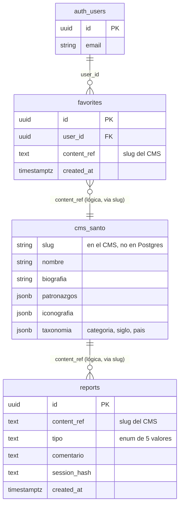

---
tags:
  - proyecto/fosforo
  - santopedia
  - base-de-datos
  - supabase
  - web
type: app-arquitectura
area: aplicaciónes
status: draft
created: 2026-09-05
updated: 2026-09-05
related:
  - "[[02-SRS|02-SRS]]"
  - "[[08-Decisiones de Arquitectura|08-Decisiones de Arquitectura]]"
---

# Santopedia — Esquema de Datos

> Generado con Kimi K3 (Moonshot AI). Owner: Iván Ezequiel Iencinella.

## 1. Principio fundamental: el contenido vive en el CMS

Santopedia **no duplica contenido**: la biografía, patronazgos, iconografía, atributos y taxonomías de los santos viven exclusivamente en el CMS (content type `santo`). Este esquema solo persiste lo que es exclusivamente de la app web: **favoritos de usuarios** y **reportes de error de contenido**. El cache SSR del contenido es transitorio y nunca es fuente de verdad (ver ADR-SANTO-001 y ADR-SANTO-003 en [08-Decisiones de Arquitectura](08-Decisiones%20de%20Arquitectura.md)).

`content_ref` es una referencia **lógica** al slug del content type `santo` del CMS: es un `text` validado por patrón, sin FK a nivel base (el CMS no es Postgres), con validación de existencia al momento de uso (la ficha existe si el CMS la sirve).

## 2. Esquema `santopedia`

Todo el estado de usuario de la app vive en el esquema dedicado `santopedia` de Supabase. Ninguna tabla de la app se crea en `public` ni en esquemas de otras apps.

### 2.1 Tabla `favorites`

```sql
create schema if not exists santopedia;

create table if not exists santopedia.favorites (
  id          uuid primary key default gen_random_uuid(),
  user_id     uuid not null references auth.users (id) on delete cascade,
  content_ref text  not null check (content_ref ~ '^[a-z0-9]+(-[a-z0-9]+)*$'),
  created_at  timestamptz not null default now(),
  constraint favorites_user_content_unique unique (user_id, content_ref)
);

create index if not exists favorites_user_created_idx
  on santopedia.favorites (user_id, created_at desc);

alter table santopedia.favorites enable row level security;

create policy favorites_select_own on santopedia.favorites
  for select using (auth.uid() = user_id);

create policy favorites_insert_own on santopedia.favorites
  for insert with check (auth.uid() = user_id);

create policy favorites_delete_own on santopedia.favorites
  for delete using (auth.uid() = user_id);
```

- `content_ref`: slug canónico del santo en el CMS (referencia lógica, sin FK).
- `unique (user_id, content_ref)`: idempotencia del "marcar favorito".
- RLS: el usuario solo ve, inserta y borra sus filas (`auth.uid() = user_id`).

### 2.2 Tabla `reports`

```sql
create table if not exists santopedia.reports (
  id           uuid primary key default gen_random_uuid(),
  content_ref  text not null check (content_ref ~ '^[a-z0-9]+(-[a-z0-9]+)*$'),
  tipo         text not null check (tipo in ('biografia','patronazgo','fiesta','imagen','otro')),
  comentario   text not null check (char_length(comentario) between 1 and 1000),
  session_hash text not null,
  created_at   timestamptz not null default now()
);

create index if not exists reports_content_created_idx
  on santopedia.reports (content_ref, created_at desc);

alter table santopedia.reports enable row level security;

create policy reports_insert_anyone on santopedia.reports
  for insert with check (true);
-- Sin policy de select/update/delete: la tabla es insert-only desde la app.
```

- `session_hash`: hash salteado (HMAC con sal en server) de la sesión, para limitar abuso por rate limiting **sin** almacenar IP ni identificadores (ver SEC-SANTO-005 en [10-OWASP](10-OWASP.md)).
- **Insert-only:** solo existe policy de `insert`; no hay `select/update/delete` para la app web. La lectura editorial la hace el equipo vía canal de administración del CMS, no desde Santopedia.

### 2.3 Modelo conceptual de referencia



## 3. DD-SANTO: decisiones de datos

| ID           | Decisión                                                                                        | Justificación                                                                                               |
| ------------ | ----------------------------------------------------------------------------------------------- | ----------------------------------------------------------------------------------------------------------- |
| DD-SANTO-001 | Sin tabla de santos en Postgres; solo `content_ref` lógico al CMS                               | El contenido ya tiene un sistema de edición, versionado y revisión en el CMS; duplicarlo genera divergencia |
| DD-SANTO-002 | `favorites` con `unique (user_id, content_ref)` y RLS completa (select/insert/delete del dueño) | Idempotencia del toggle y aislamiento estricto por usuario                                                  |
| DD-SANTO-003 | `reports` insert-only con `session_hash` salteado y sin IP                                      | Privacidad por diseño (sin PII) y suficiente para rate limiting y trazabilidad editorial                    |

## 4. Reglas de integridad

| ID           | Regla                                                                                                                          |
| ------------ | ------------------------------------------------------------------------------------------------------------------------------ |
| RI-SANTO-001 | `content_ref` debe matchear el patrón de slug; los endpoints validan existencia contra el CMS antes de usarlo                  |
| RI-SANTO-002 | No se puede insertar el mismo favorito dos veces (constraint único; el toggle usa upsert/delete)                               |
| RI-SANTO-003 | `tipo` de reporte restringido por check a los 5 valores del FRD                                                                |
| RI-SANTO-004 | `comentario` entre 1 y 1000 caracteres (validado en cliente y en base)                                                         |
| RI-SANTO-005 | Borrado de usuario en Auth propaga el borrado de sus favoritos (`on delete cascade`); los reportes se conservan (son anónimos) |
| RI-SANTO-006 | Toda lectura/escritura pasa por RLS; la app nunca usa service role en cliente (server-side únicamente)                         |

## 5. Migraciones y entorno

- Migraciones SQL versionadas en `db/scripts/` siguiendo [db/README.md](../../../db/README.md), con el esquema `santopedia` como unidad.
- RLS habilitado obligatoriamente en ambas tablas; un despliegue sin RLS activo debe fallar el pipeline.
- Sin datos semilla de contenido de santos en Postgres: el contenido es del CMS.
