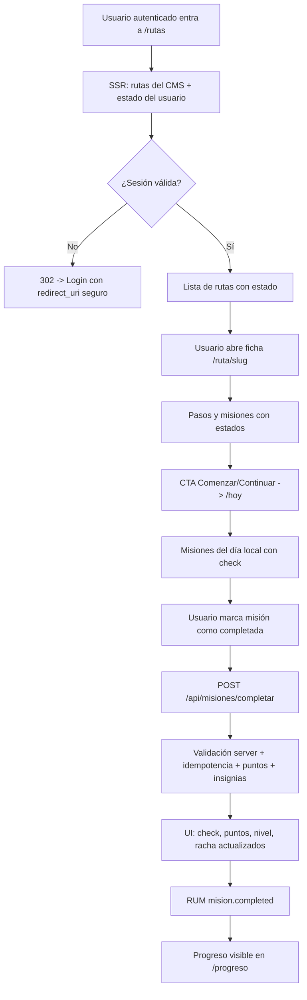
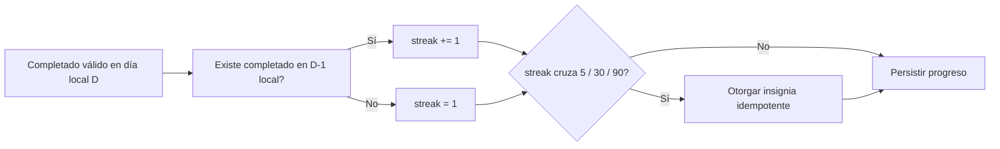
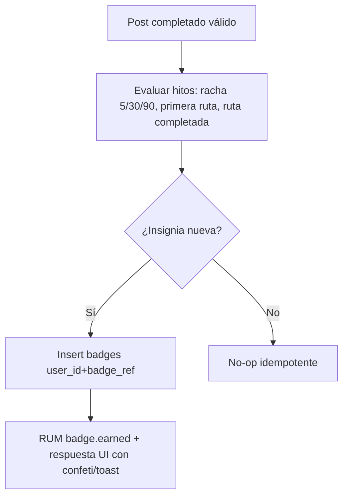
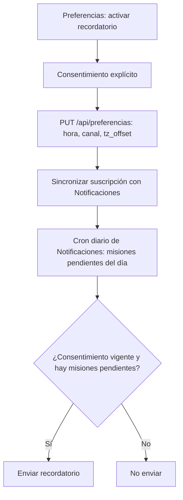
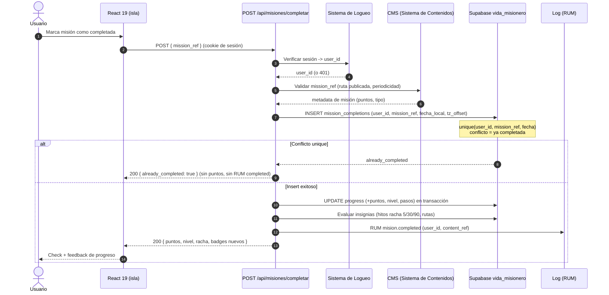
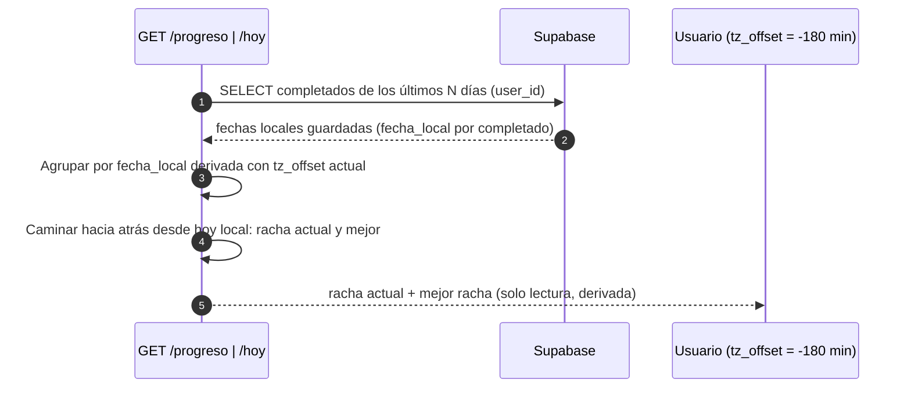
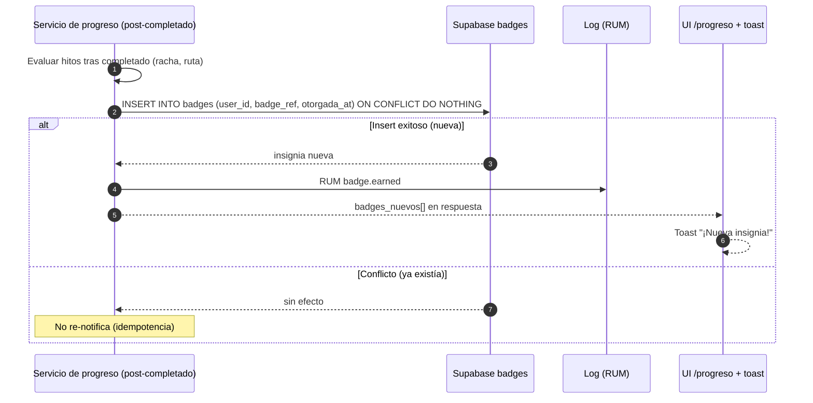
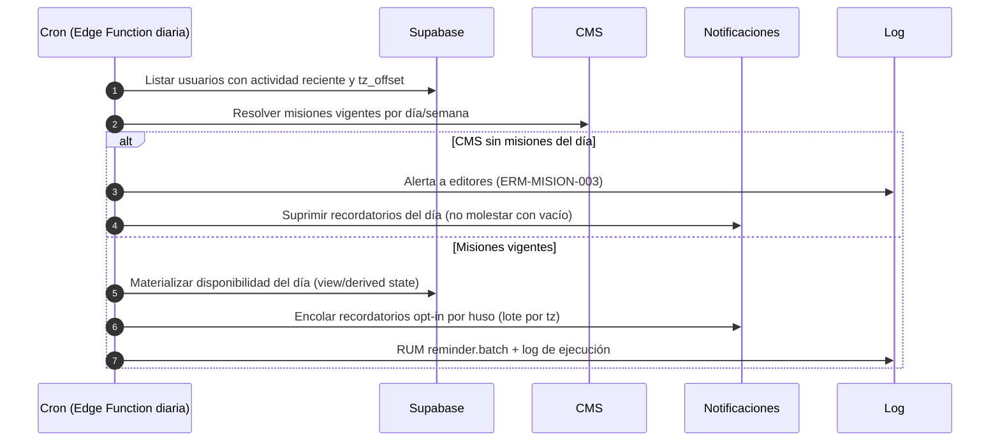

---
tags:
  - proyecto/fosforo
  - aplicación
  - fase-2
type: app-arquitectura
area: aplicaciónes
status: draft
created: 2026-09-05
updated: 2026-09-05
related:
  - "[[03-FRD|FRD Vida de Misionero]]"
  - "[[05-Tests Unitarios|Tests Unitarios]]"
---

# Flujos y Secuencias - Vida de Misionero (WEB)

> Generado con Kimi K3 (Moonshot AI). Owner: Iván Ezequiel Iencinella.

## 1. Flujo principal: elegir ruta -> completar misión -> progreso

Notas del flujo:

- El único punto de mutación de progreso es `POST /api/misiones/completar` (RB-MISION-002).
- El contenido mostrado en cada pantalla viene del CMS con cache de revalidación (RB-MISION-001).

## 2. Flujos secundarios

### 2.1 Racha (streak)

- La racha SIEMPRE se calcula con `tz_offset` del usuario (RB-MISION-005); el día local D = `timestamp_utc + tz_offset` truncado a fecha.
- Sin completado en un día local, el streak derivado cae a 0 en la próxima lectura (no hay flags que "rompan": es derivado).

### 2.2 Insignias por hitos

### 2.3 Recordatorio diario (opt-in)

## 3. Secuencia: completar misión (validación server + idempotencia + puntos + RUM)

Puntos de anti-fraude en la secuencia:

1. `user_id` SIEMPRE de la sesión verificada (nunca del body) - RB-MISION-003.
2. La misión debe existir y estar publicada en el CMS en el momento del completado - RB-MISION-001.
3. Vigencia por día/semana LOCAL del usuario - RB-MISION-005/007.
4. Idempotencia por unique constraint en DB (la garantía final) - RB-MISION-004.
5. Rate limit antes de tocar DB - SEC-MISION-004.

## 4. Secuencia: calcular streak con zona horaria

- Regla: un día local cuenta si existe >= 1 completado con esa `fecha_local`.
- `fecha_local` se guarda al momento del completado usando el `tz_offset` vigente; si el usuario cambia de zona, los históricos NO se reescriben (inmutabilidad de completados) y la racha se evalúa sobre días locales históricos + vigencia actual (ADR-MISION-004).

## 5. Secuencia: otorgar insignia

## 6. Secuencia: reset diario (cron/edge)

- El reset no borra historial: la disponibilidad del día se deriva de `mission_completions` por `fecha_local` (RB-MISION-007); el cron solo materializa la vista del día y encola notificaciones.
- Idempotencia del cron: correr dos veces el mismo día produce el mismo estado (no duplica notificaciones).

## 7. Estados de error del flujo principal

| Punto de falla          | Comportamiento                                                                                                          |
| ----------------------- | ----------------------------------------------------------------------------------------------------------------------- |
| Sesión expirada al POST | 401 -> UI pide re-login conservando contexto                                                                            |
| CMS caído en ficha      | Cache stale + banner; completado validado contra cache marcado `stale` solo si vigencia lo permite, sino 503 controlado |
| DB caída al POST        | 503 con mensaje "No pudimos registrar tu misión, probá de nuevo"; SIN pérdida: reintento idempotente                    |
| RUM caído               | Best-effort: la acción del usuario NO se afecta                                                                         |
| Notificaciones caído    | Preferencia se marca `pendiente_sync` y se reintenta; se informa en Preferencias                                        |
