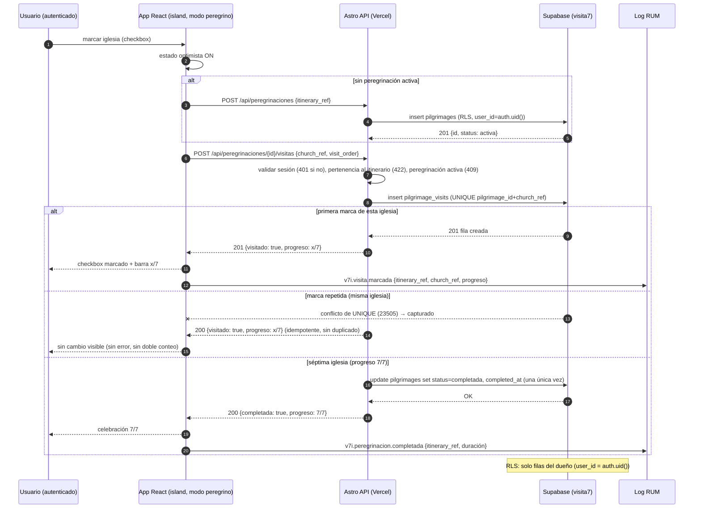

---
tags:
  - proyecto/fosforo
  - aplicacion
  - visita-7-iglesias
  - web
  - fase-2
  - flujos
  - secuencias
type: app-arquitectura
area: aplicaciones
status: draft
created: 2026-09-05
updated: 2026-09-05
related:
  - "[[03-FRD]]"
  - "[[09-Especificacion Tecnica]]"
---

# Visita 7 Iglesias - Web - Flujos y Secuencias

> Generado con Kimi K3 (Moonshot AI). Owner: Iván Ezequiel Iencinella.

## Flujo principal: elegir itinerario → modo peregrino → marcar visitas → completar

1. El usuario llega a `/itinerarios` (o a la home de la app) y elige su ciudad (MVP: 3 ciudades base).
2. La página SSR consulta el CMS (`GET /api/content/itinerario?taxonomy={ciudad}`) y renderiza el listado de itinerarios cacheado.
3. El usuario abre la ficha `/itinerario/[slug]`: ve las 7 iglesias con nombre, dirección textual, mapa embebido y la oración de cada visita (todo del CMS). Se emite RUM `v7i.itinerario.visto`.
4. El usuario activa el **modo peregrino** (lista con checkboxes). Si no tiene una peregrinación activa para ese itinerario, al marcar la primera iglesia se crea (`status = activa`); sin sesión, se muestra CTA "Iniciá sesión para registrar tu visita" (V7I-001).
5. En cada iglesia, el usuario reza la oración de la visita y **marca el checkbox**: `POST /api/peregrinaciones/{id}/visitas` escribe en `visita7.pilgrimage_visits` con idempotencia por `UNIQUE (pilgrimage_id, church_ref)`. Se emite RUM `v7i.visita.marcada` con progreso x/7.
6. La barra de progreso refleja el avance en tiempo real (optimista con rollback en error).
7. Al marcar la séptima iglesia: la peregrinación pasa a `status = completada` (una única vez, con `completed_at`), se muestra la **celebración** (7/7) y se emite RUM `v7i.peregrinacion.completada`.

## Flujos secundarios

### Flujo de reordenar el modo peregrino

1. En el modo peregrino, el usuario toca "ordenar" y mueve iglesias arriba/abajo.
2. La app persiste el orden propio en `visita7.preferences` (RLS); por defecto se usa el orden sugerido del CMS (RB-V7I-005).
3. La lista se re-renderiza con el nuevo orden; el orden no afecta el contenido ni la idempotencia de las marcas.

### Flujo de reporte de datos de iglesia

1. Desde la ficha, el usuario abre "Reportar problema" en una iglesia.
2. Elige motivo (dirección incorrecta, horario incorrecto, iglesia cerrada, otro) y escribe comentario opcional (V7I-004 si falta el motivo).
3. Se inserta el reporte (insert-only, `session_hash` anónimo).
4. El equipo editorial corrige el dato **en el CMS**; la app refleja la corrección desde la próxima renderización (RB-V7I-007, SLO < 48 h en temporada).

### Flujo de contexto litúrgico

1. Al cargar home o ficha, la app consulta `GET /api/liturgia/{fecha}` al Motor Litúrgico de forma no bloqueante.
2. Si el día está en Cuaresma (o es Jueves Santo), se muestra un mensaje informativo de acompañamiento; en Jueves Santo se refuerza la invitación a completar la peregrinación.
3. Motor caído o timeout → el mensaje se omite silenciosamente; ninguna acción del usuario queda bloqueada (ADR-V7I-006).

## Secuencia 1: marcar visita (idempotencia + RLS + RUM)



## Secuencia 2: completar peregrinación (7/7 + celebración + insignia post-MVP)

```mermaid
sequenceDiagram
    autonumber
    participant U as Usuario (autenticado)
    participant A as App
    participant S as Supabase (visita7)
    participant R as Log RUM

    U->>A: marca la séptima iglesia
    A->>S: POST visita (via API) → 7 filas visitadas
    S->>S: COUNT = 7 → update pilgrimages.status = 'completada' (idempotente, guard: solo si status='activa')
    S-->>A: {status: completada, completed_at}
    A-->>U: vista de celebración (7/7) + recapitulación (fecha, iglesias)
    A->>R: v7i.peregrinacion.completada {itinerary_ref, duración}
    Note over U,A: Post-MVP: la completación habilita una insignia en el perfil; en MVP es solo la celebración en pantalla.
    U->>A: (opcional) iniciar nueva peregrinación
    A->>S: nueva pilgrimages {status: activa} (el progreso anterior queda como historial propio)
```

## Secuencia 3: carga de itinerario (SSR + cache CMS)

```mermaid
sequenceDiagram
    autonumber
    participant U as Usuario
    participant C as CDN
    participant A as Astro SSR (Vercel)
    participant CMS as CMS (API lectura)
    participant M as Motor Litúrgico
    participant R as Log RUM

    U->>C: GET /itinerario/jueves-santo-caba
    C->>A: MISS → render
    par contenido del CMS
        A->>CMS: GET /api/content/itinerario?slug=jueves-santo-caba (API key en SSR)
        CMS-->>A: itinerario + 7 iglesias + oraciones (200)
    and contexto litúrgico (no bloqueante)
        A->>M: GET /api/liturgia/{fecha}
        M-->>A: Cuaresma / Jueves Santo (200) | timeout → omitir
    end
    A-->>C: HTML cacheable (tag: itinerario=jueves-santo-caba)
    C-->>U: HTML (HIT en próximas requests)
    A->>R: v7i.itinerario.visto {slug}
    Note over C,CMS: Jueves Santo: el tráfico se sirve casi todo desde CDN (HIT); si el CMS cae, última cache válida + banner de degradación
```

## Reglas transversales de los flujos

- Ningún flujo de lectura requiere sesión; solo marcar visitas, reordenar y preferencias exigen autenticación (RB-V7I-003).
- Toda escritura en `visita7` es idempotente y protegida por RLS; el conflicto de `UNIQUE` se trata como éxito (200) para el usuario, nunca como error visible (RB-V7I-002).
- Si el CMS no responde, siempre se sirve última cache válida + banner; jamás se sirve contenido local (RB-V7I-001).
- El contexto litúrgico es informativo: su ausencia (Motor caído o fuera de temporada) no bloquea ninguna acción (ADR-V7I-006).
- Todos los eventos RUM respetan el anonimato: solo refs (`itinerary_ref`, `church_ref`) y progreso; sin PII ni ubicación precisa (NFR-V7I-006).
